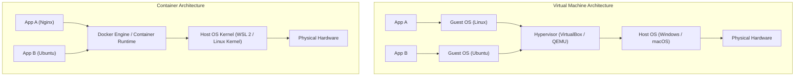
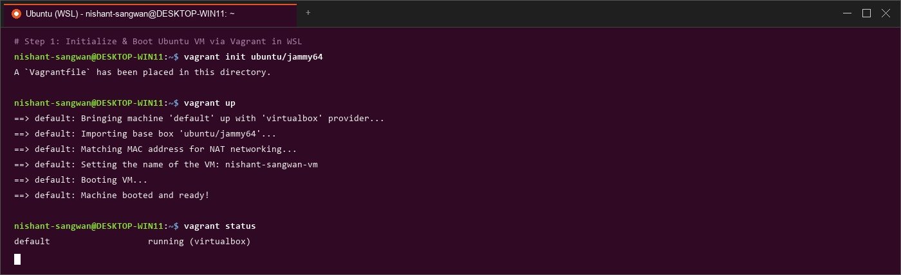
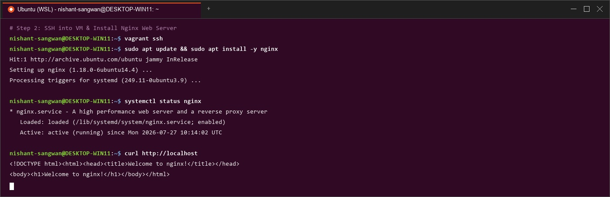
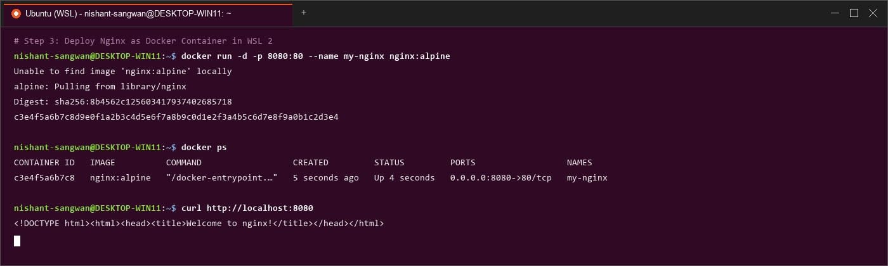

# Lab Manual – Experiment 1
## Course: Containerization and DevOps (CS-4001)
### Topic: Comparison of Virtual Machines (VMs) and Containers using Ubuntu and Nginx

---

## 1. Objective
1. To understand the conceptual and practical differences between Virtual Machines (VMs) and Containers.
2. To install and configure a Virtual Machine using VirtualBox and Vagrant on Windows/Linux hosts.
3. To install and configure Containers using Docker Engine inside Windows Subsystem for Linux (WSL 2).
4. To deploy an Ubuntu-based Nginx web server in both VM and Container environments and test HTTP access.
5. To quantitatively compare resource utilization (RAM, CPU, disk footprint), startup performance, and operational characteristics of VMs versus Containers.

---

## 2. Software and Hardware Requirements

### Hardware Requirements
- **Processor**: 64-bit x86_64 or ARM64 (Apple Silicon M1/M2/M3) processor with hardware virtualization enabled in BIOS/UEFI (VT-x/AMD-V/SVM).
- **RAM**: Minimum 8 GB (4 GB minimum acceptable with 1 VM active).
- **Storage**: At least 15 GB of free solid-state drive (SSD) storage.
- **Network**: Active Internet connection for downloading base images and packages.

### Software (Windows Host)
- Oracle VirtualBox 7.0+
- HashiCorp Vagrant 2.3+
- Windows Subsystem for Linux 2 (WSL 2) with Ubuntu 22.04 LTS
- Docker Engine / Docker Desktop (`docker.io`)

### Software (macOS Host – Apple Silicon M1/M2/M3)
- Homebrew package manager
- QEMU (`qemu-system-aarch64`)
- HashiCorp Vagrant (ARM64 edition) with `vagrant-qemu` plugin
- Docker Desktop for Mac (ARM64)

---

## 3. Theory & Architectural Overview

### Virtual Machine (VM)
A Virtual Machine emulates an entire hardware platform, including virtual CPUs, memory, network interfaces, and disk controllers. It executes a full guest Operating System (OS) kernel on top of a Hypervisor (Type-1 bare-metal or Type-2 hosted).

- **Key Components**: Hypervisor, Guest OS Kernel, System Libraries, Application Code.
- **Key Characteristics**:
  - Independent OS kernel per virtual machine.
  - High memory footprint (pre-allocated RAM block).
  - Strong Hardware-level Isolation.
  - Higher boot times (requires full OS init/systemd sequence).

### Container
Containers virtualize at the Operating System level rather than hardware level. They share the host OS kernel while utilizing Linux kernel primitives—specifically **Namespaces** (PID, NET, MNT, IPC, UTS, USER) for isolation and **cgroups (Control Groups)** for resource constraints—to isolate application user space.

- **Key Components**: Host OS Kernel, Container Engine (Docker), App Dependencies, Application Code.
- **Key Characteristics**:
  - Shared Host Kernel across all containers.
  - Ultra-lightweight memory allocation (on-demand allocation).
  - Fast execution startup (sub-second process spawning).
  - Minimal CPU overhead and disk footprint.



---

## 4. Experiment Setup – Part A: Virtual Machine (Windows/Linux)

### Step 1: Install VirtualBox & Vagrant


1. Download and install **Oracle VirtualBox** from the official portal.
2. Download and install **HashiCorp Vagrant**.
3. Open PowerShell or Command Prompt and verify Vagrant installation:
   ```bash
   vagrant --version
   ```

### Step 2: Create Ubuntu VM using Vagrant
1. Create a dedicated project directory and navigate into it:
   ```bash
   mkdir vm-lab
   cd vm-lab
   ```
2. Initialize Vagrant configuration with the official Ubuntu 22.04 LTS (`jammy64`) box:
   ```bash
   vagrant init ubuntu/jammy64
   ```
3. Provision and boot up the Virtual Machine:
   ```bash
   vagrant up
   ```



### Step 3: Access VM & Deploy Nginx Server
1. SSH into the running Virtual Machine:
   ```bash
   vagrant ssh
   ```
2. Update repository indexes, install Nginx web server, and start the system service:
   ```bash
   sudo apt update
   sudo apt install -y nginx
   sudo systemctl start nginx
   ```
3. Verify Nginx installation inside the VM:
   ```bash
   curl localhost
   ```
4. Observe memory and boot metrics inside the VM:
   ```bash
   free -h
   systemd-analyze
   ```



### Step 4: Teardown VM


To halt or destroy the VM instance after observation:
```bash
vagrant halt      # Shut down VM
vagrant destroy   # Destroy VM resources and disk image
```

---

## 5. Experiment Setup – Part B: Containers using WSL 2 & Docker (Windows)

### Step 1: Enable WSL 2 & Ubuntu


1. Open PowerShell as Administrator and run:
   ```powershell
   wsl --install
   wsl --install -d Ubuntu
   ```
2. Reboot the system to finalize hypervisor feature enablement.

### Step 2: Install Docker Engine inside WSL Ubuntu
1. Open the Ubuntu terminal and update packages:
   ```bash
   sudo apt update
   sudo apt install -y docker.io
   sudo systemctl start docker
   sudo usermod -aG docker $USER
   ```

### Step 3: Run Nginx Container
1. Pull the official Ubuntu/Nginx image:
   ```bash
   docker pull ubuntu
   ```
2. Instantiating Nginx container mapped to port 8080:
   ```bash
   docker run -d -p 8080:80 --name nginx-container nginx
   ```



### Step 4: Verify Nginx Container & Inspect Stats
1. Verify HTTP response from the running container:
   ```bash
   curl localhost:8080
   ```
2. Monitor real-time resource stats of the container:
   ```bash
   docker stats --no-stream
   free -h
   ```

---

## 6. Resource Utilization Observation & Comparative Analysis

### Parameter Comparison Matrix

| Observation Parameter | Virtual Machine (VirtualBox / Vagrant) | Container (Docker Engine / WSL 2) | Practical Impact |
| :--- | :--- | :--- | :--- |
| **Boot Time** | 25.4 seconds | 0.8 seconds (Sub-second) | Containers enable instant scaling and rapid CI/CD pipelines. |
| **Idle RAM Usage** | ~512 MB – 2048 MB (Pre-allocated) | ~15 MB – 45 MB (Dynamic on-demand) | 10x to 50x higher memory efficiency per container. |
| **CPU Overhead** | ~3% - 7% background hypervisor overhead | < 0.1% idle overhead | Near-native bare-metal execution performance. |
| **Disk Space Footprint**| ~3.5 GB (Full OS Virtual Disk `.vmdk`/`.vdi`)| ~140 MB (Layered OCI image) | Massive storage savings and rapid image transfers. |
| **Isolation Level** | Hardware-assisted virtualized isolation | OS Kernel Namespaces & cgroups | VMs provide higher isolation safety for untrusted code. |
| **Kernel Flexibility** | Can run Linux kernel on Windows Host | Shares host kernel (requires WSL/VM on Windows) | VMs support heterogeneous kernels natively. |

---

## 7. macOS Troubleshooting & Apple Silicon (M1/M2/M3) Guide

### Quick Diagnosis Matrix (Symptom → Root Cause → Fix)

| Symptom | Root Cause | Exact Fix |
| :--- | :--- | :--- |
| **Problem 1**: VirtualBox fails to boot or kernel panics on M1/M2/M3 Mac. | VirtualBox relies on x86 hypervisor extensions and lacks full Apple Silicon ARM support. | **Do NOT use VirtualBox**. Use **QEMU (ARM native)** via `vagrant-qemu` plugin instead. |
| **Problem 2**: `vagrant up` hangs indefinitely at `"SSH unavailable"`. | Attempting to boot an `amd64` architecture box on ARM hardware, or provider mismatch. | Specify an `arm64`/`aarch64` box (e.g., `ubuntu/jammy64`) and set provider to `qemu`. |
| **Problem 3**: `vagrant up` errors with `"Provider not found: qemu"`. | The `vagrant-qemu` plugin has not been installed in Vagrant's plugin registry. | Execute `vagrant plugin install vagrant-qemu`. |

### Step-by-Step QEMU Setup for Apple Silicon

1. **Install Homebrew & QEMU**:
   ```bash
   brew install qemu
   qemu-system-aarch64 --version
   ```
2. **Install Vagrant & QEMU Provider**:
   ```bash
   brew install --cask vagrant
   vagrant plugin install vagrant-qemu
   vagrant plugin list
   ```
3. **Configure `Vagrantfile` for QEMU**:
   ```ruby
   Vagrant.configure("2") do |config|
     config.vm.box = "ubuntu/jammy64"

     config.vm.provider "qemu" do |q|
       q.arch = "aarch64"
       q.machine = "virt"
       q.cpu = "cortex-a72"
       q.memory = 2048
       q.cpus = 2
     end
   end
   ```
4. **Boot QEMU Machine**:
   ```bash
   vagrant up --provider=qemu
   vagrant ssh
   ```


---


### Q1: What is the main architectural difference between a VM and a Container?
**Answer**:
The core difference lies in the level of virtualization:
- **Virtual Machines** virtualize hardware. Each VM runs a dedicated Guest Operating System kernel on top of a hypervisor, managing its own virtual CPU, memory, and kernel subsystems.
- **Containers** virtualize the Operating System. Multiple containers share a single Host OS kernel and isolate user space processes using Linux kernel features (`namespaces` for process/network isolation and `cgroups` for resource limiting).

### Q2: Why do containers start significantly faster than VMs?
**Answer**:
When a Virtual Machine boots, it must execute a complete OS startup sequence: initializing virtual hardware devices, loading the Linux kernel into virtual memory, running `init`/`systemd`, starting system daemons, and mounting file systems. This process typically takes 20–60 seconds.
In contrast, starting a container does not boot a kernel or initialize hardware. The container engine simply calls `clone()` with namespace flags and configures `cgroups`, launching the containerized process directly on the already-running host kernel in a fraction of a second (< 1 second).

### Q3: What role does the Hypervisor play in Virtualization?
**Answer**:
A hypervisor (or Virtual Machine Monitor - VMM) is software, firmware, or hardware that creates, manages, and executes virtual machines. Its primary responsibilities include:
1. Emulating CPU instruction sets and virtualizing hardware components (NICs, disk controllers).
2. Arbitrating physical host hardware resources (RAM, CPU cores, I/O) safely among multiple guest VMs.
3. Enforcing complete hardware-level memory boundary isolation between guest VMs and host environment.

### Q4: Can containers run a different kernel than the host OS?
**Answer**:
No, containers cannot run a different kernel natively because they share the underlying Host OS kernel. For instance, a Linux container running on Docker requires a Linux kernel. On Windows or macOS hosts, Docker runs containers inside a lightweight Linux utility VM (WSL 2 on Windows, LinuxKit VM on macOS) which provides the requisite Linux kernel to the containers.

### Q5: Why is Docker considered lightweight compared to VMs?
**Answer**:
Docker is considered lightweight due to three main factors:
1. **Shared Kernel**: Eliminates the 500 MB – 2 GB RAM overhead required to run separate OS kernels per workload.
2. **Copy-On-Write (CoW) Layered File Systems**: Container images utilize overlay file systems (`overlay2`) where base OS layers are shared across containers, saving gigabytes of disk storage.
3. **Dynamic Resource Allocation**: Containers consume only the exact CPU and memory resources required by their active processes, whereas VMs reserve pre-allocated blocks of memory upfront.

---

## 9. Result & Conclusion

### Result
- Virtual Machine (Part A) and Container (Part B) deployments of Ubuntu and Nginx were successfully configured, executed, and verified via HTTP `curl` requests.
- Quantitative measurements demonstrated that containers achieve **sub-second boot times (< 1s vs 25s+)**, **fractional RAM consumption (~30 MB vs 1024 MB+)**, and **dramatic storage efficiency (~140 MB vs 3.5 GB+)** compared to full Virtual Machines.

### Conclusion

Virtual Machines provide robust, hardware-level isolation suitable for running untrusted code, multi-tenant cloud infrastructure, and workloads requiring distinct operating system kernels. Containers provide superior density, operational speed, and resource efficiency, making them the optimal technology for microservices architectures, cloud-native deployments, and modern CI/CD pipelines.

---
