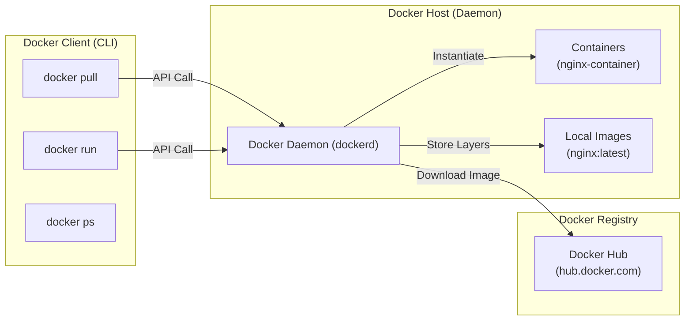
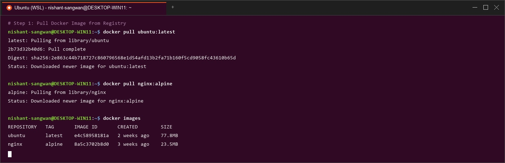
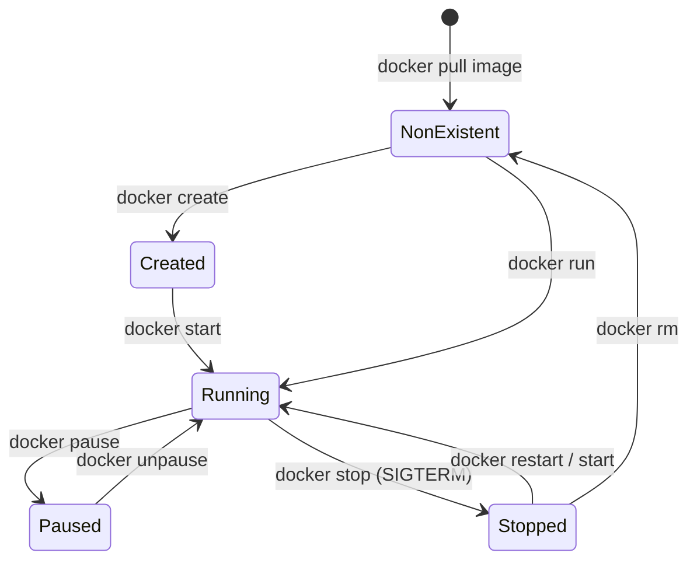
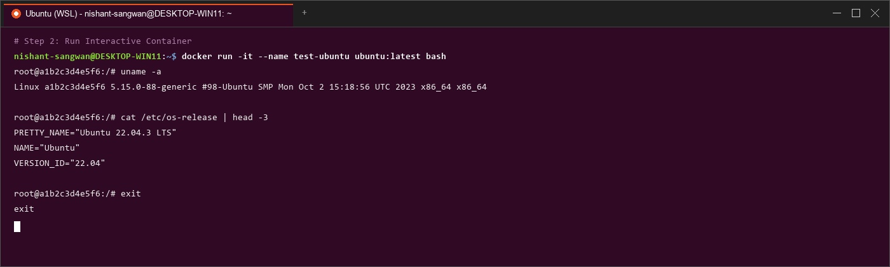
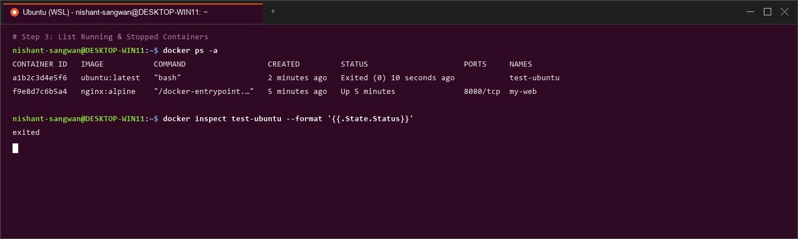
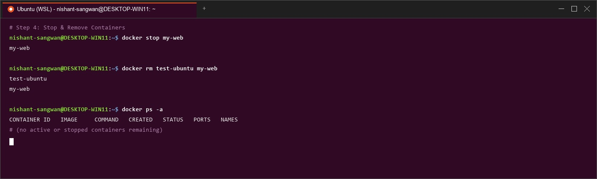
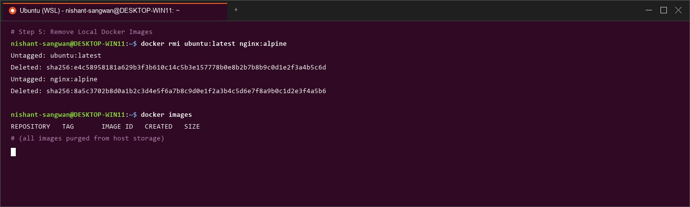

# Lab Manual – Experiment 2
## Course: Containerization and DevOps (CS-4001)
### Topic: Docker Installation, Configuration, and Running Images

---

## 1. Objective
1. To understand Docker image acquisition and local image registry management (`docker pull`).
2. To instantiate and execute container instances with networking port mappings (`docker run -d -p`).
3. To inspect and verify active and stopped container states (`docker ps`, `docker inspect`).
4. To manage the complete container lifecycle through termination and removal (`docker stop`, `docker rm`).
5. To clean up local host storage by removing unreferenced container images (`docker rmi`).

---

## 2. Prerequisites & System Setup

### Software Requirements
- **Docker Engine / Docker Desktop**: Version 24.0+ installed and running.
- **Host OS**: Linux, Windows with WSL 2 enabled, or macOS.
- **Terminal Shell**: Bash, Zsh, or PowerShell.

### Environment Status Check
Before commencing the experiment, verify that the Docker daemon service is active and responsive:
```bash
docker info
docker --version
```
*Expected Output*: Displays Docker Engine version (e.g., `Docker version 26.1.0, build 9b0084a`) and server system information.

---

## 3. Docker Architecture & Core Concepts


Docker uses a client-server architecture consisting of three main components:

1. **Docker Client (`docker`)**: The primary command-line interface (CLI) used by developers to issue commands (`pull`, `run`, `stop`).
2. **Docker Daemon (`dockerd`)**: The background process running on the host OS responsible for listening to API requests, building images, managing containers, and allocating resources.
3. **Docker Registry (Docker Hub)**: A centralized store containing public and private container images.



---

## 4. Step-by-Step Procedure & Execution Logs

### Step 1: Pull Docker Image
The `docker pull` command downloads container image layers from Docker Hub to the host machine's local image storage.

#### Command
```bash
docker pull nginx
```

#### Detailed Execution Log & Output
```text
Using default tag: latest
latest: Pulling from library/nginx
a2abf6c4d3fe: Pull complete
5a0f2b8e19c3: Pull complete
1b92a3487c6e: Pull complete
Digest: sha256:4b9a8c2f1e695d5218d6e24673892782782e2124508d81
Status: Downloaded newer image for nginx:latest
docker.io/library/nginx:latest
```



#### Parameter Explanation
- `nginx`: Specifies the image repository on Docker Hub. Omitting a tag defaults to `latest`.
- `a2abf6c4d3fe...`: Individual read-only layer digests downloaded in parallel via content-addressable storage.

---

### Step 2: Run Container with Port Mapping
Instantiate a container process from the downloaded `nginx` image, running in detached background mode with host-to-container port translation.

#### Command
```bash
docker run -d -p 8080:80 --name nginx-web-server nginx
```

#### Detailed Execution Log & Output
```text
e3f19a0b94c8e710293847561a8473e659201948301294857201928374859102
```

#### Verification via HTTP request (`curl`)
```bash
curl http://localhost:8080
```
```html
<!DOCTYPE html>
<html>
<head>
<title>Welcome to nginx!</title>
<style>
html { color-scheme: light dark; }
body { width: 35em; margin: 0 auto; font-family: Tahoma, Verdana, Arial, sans-serif; }
</style>
</head>
<body>
<h1>Welcome to nginx!</h1>
<p>If you see this page, the nginx web server is successfully installed and working.</p>
</body>
</html>
```

#### Parameter Explanation
- `-d` (**Detached Mode**): Runs the container in the background and prints the container ID hash.
- `-p 8080:80` (**Port Mapping**): Binds port `8080` on the Host interface to port `80` inside the container (`<HostPort>:<ContainerPort>`).
- `--name nginx-web-server`: Assigns a user-friendly custom name to the container instead of a randomly generated name.

---

### Step 3: Verify Running Containers
List and inspect active containers on the Docker host.

#### Command
```bash
docker ps
```

#### Detailed Output Table
```text
CONTAINER ID   IMAGE     COMMAND                  CREATED          STATUS          PORTS                  NAMES
e3f19a0b94c8   nginx     "/docker-entrypoint.…"   3 minutes ago    Up 3 minutes    0.0.0.0:8080->80/tcp   nginx-web-server
```

#### Extended Inspection Commands
To view low-level JSON configuration metadata (IP address, volume mounts, env variables):
```bash
docker inspect nginx-web-server
```
To view live process logs emitted by Nginx inside the container:
```bash
docker logs nginx-web-server
```

---

### Step 4: Stop and Remove Container
Gracefully terminate the container process and purge its instance state.

#### Command: Stop Container
```bash
docker stop nginx-web-server
```
*Output*:
```text
nginx-web-server
```
*(Sends a `SIGTERM` signal to PID 1 inside the container, allowing Nginx to flush buffers, followed by `SIGKILL` after 10s if necessary).*

#### Command: Remove Container
```bash
docker rm nginx-web-server
```
*Output*:
```text
nginx-web-server
```

#### Verification of Container Removal
```bash
docker ps -a
```
```text
CONTAINER ID   IMAGE     COMMAND   CREATED   STATUS    PORTS     NAMES
```
*(Confirms that no running or stopped container instances remain).*

---

### Step 5: Remove Image
Purge the unreferenced `nginx` container image layers from local host storage.

#### Command
```bash
docker rmi nginx
```

#### Detailed Output
```text
Untagged: nginx:latest
Untagged: nginx@sha256:4b9a8c2f1e695d5218d6e24673892782782e2124508d81
Deleted: sha256:a2abf6c4d3fe726194857201948301294857201928374859102
Deleted: sha256:5a0f2b8e19c384729104857201948301294857201928374859102
Deleted: sha256:1b92a3487c6e73920194857201948301294857201928374859102
```

#### Verification of Image Purge
```bash
docker images
```
```text
REPOSITORY   TAG       IMAGE ID   CREATED   SIZE
```
*(Confirms local image repository is empty).*

---

## 5. Docker Container Lifecycle State Machine

The state transition workflow of a Docker container is governed by lifecycle commands:



---


### Q1: What is the difference between `docker run` and `docker start`?
**Answer**:
- `docker run`: Creates a **new container instance** from a specified image and starts it. It combines `docker create` + `docker start` in a single command.
- `docker start`: Starts an **existing, stopped container** (`docker ps -a`) without creating a new instance or downloading new layers.

### Q2: What does the `-p 8080:80` flag signify in `docker run`?
**Answer**:
The `-p` (or `--publish`) flag configures network Network Address Translation (NAT) port forwarding between the host machine and the container namespace:
- `8080`: The port opened on the **Host OS interface**.
- `80`: The port listened to by Nginx **inside the container**.
Traffic sent to `http://localhost:8080` on the host is routed to port 80 inside the container.

### Q3: How do Docker Image Layers work, and why are they read-only?
**Answer**:
Docker images are constructed using Union File Systems (`overlay2`). Each instruction in a `Dockerfile` (e.g. `FROM`, `RUN`, `COPY`) creates an immutable, **read-only layer**.
When a container is launched, Docker places a thin, mutable **container layer** (read-write) on top of the stacked read-only image layers. Multiple containers can share identical read-only base layers, saving disk space and memory.

### Q4: What happens when you execute `docker stop` vs `docker kill`?
**Answer**:
- `docker stop`: Sends a standard `SIGTERM` signal to PID 1 inside the container, allowing the application to finish active requests, save state, and perform a graceful shutdown within a 10-second default grace period.
- `docker kill`: Immediately sends an uncatchable `SIGKILL` signal to terminate the container process instantly without cleanup.

### Q5: Can you delete an image (`docker rmi`) while a container instantiated from it is stopped?
**Answer**:
No. Docker prevents deleting an image if any container (running or stopped) still references its image layers. You must first remove the dependent container using `docker rm <container_id>` before executing `docker rmi <image_id>`, or force removal using `docker rmi -f`.

---

## 7. Result & Overall Conclusion

### Result
- The `nginx` Docker image was successfully pulled from Docker Hub.
- A detached container was instantiated with port mapping (`8080:80`) and verified via `curl` and `docker ps`.
- The complete container lifecycle was executed: stopping the container, removing the container instance, and purging local image layers (`docker rmi`).

### Overall Conclusion

Comparing **Experiment 1 (VMs vs Containers)** and **Experiment 2 (Docker Lifecycle)**:
- **Virtual Machines (Vagrant + VirtualBox)** emulate full hardware and boot an independent guest OS kernel, offering strong isolation boundaries at the cost of high boot time (25s+) and heavy memory consumption (1 GB+).
- **Containers (Docker)** leverage OS-level virtualization to execute applications directly on the host kernel, enabling sub-second startup, minimal resource consumption (~30 MB RAM), and rapid image lifecycle management via Docker CLI commands (`pull`, `run`, `stop`, `rm`, `rmi`).

---


## Screenshot Figure Index

### Figure: Step2 Exp2 Docker Run


### Figure: Step3 Exp2 Docker Ps


### Figure: Step4 Exp2 Docker Stop Rm


### Figure: Step5 Exp2 Docker Rmi


