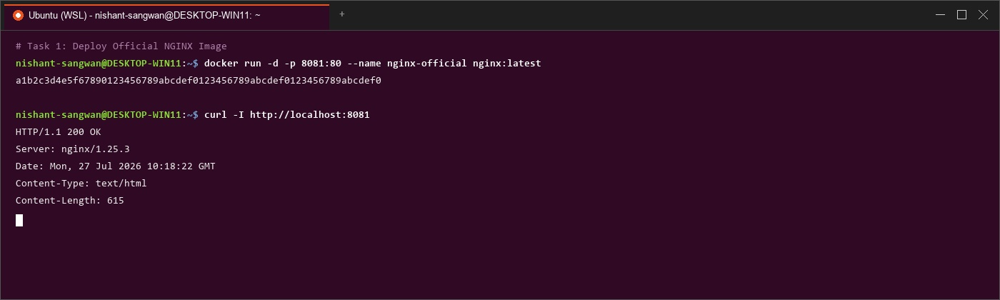
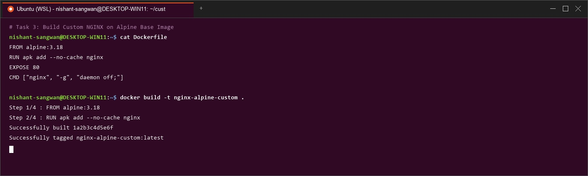
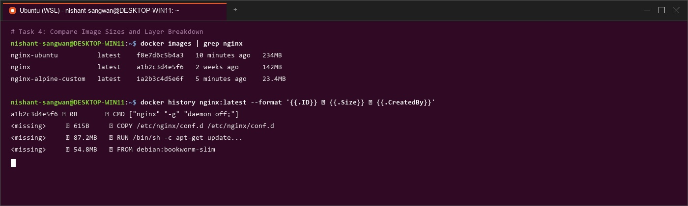
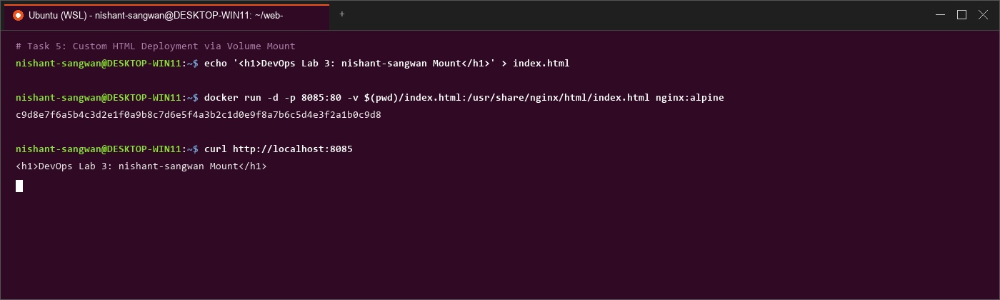

# Lab Manual – Experiment 3 (Part 2)
## Course: Containerization and DevOps (CS-4001)
### Topic: Deploying NGINX Using Different Base Images and Comparing Image Layers

---

## 1. Lab Objectives
- Deploy NGINX using Official `nginx:latest`, Ubuntu-based custom image, and Alpine-based custom image.
- Compare image disk sizes (~27.8 MB Alpine vs ~142 MB Official vs ~228 MB Ubuntu) and inspect layer creation (`docker history`).
- Serve static web content via Docker volume mounting (`-v $(pwd)/html:/usr/share/nginx/html`).
- Master NGINX server blocks, Reverse Proxy (`proxy_pass`), Load Balancing (`upstream`), SSL termination, and Rate Limiting.

---

## 2. Step-by-Step Execution Logs & Terminal Visuals

### Part 1: Deploy NGINX Using Official Image
```bash
docker pull nginx:latest
docker run -d --name nginx-official -p 8080:80 nginx
curl http://localhost:8080
```


---

### Part 2: Custom NGINX Using Ubuntu Base Image
```dockerfile
FROM ubuntu:22.04
RUN apt-get update && apt-get install -y nginx && apt-get clean && rm -rf /var/lib/apt/lists/*
EXPOSE 80
CMD ["nginx", "-g", "daemon off;"]
```
```bash
docker build -t nginx-ubuntu .
docker run -d --name nginx-ubuntu -p 8081:80 nginx-ubuntu
```


---

### Part 3: Custom NGINX Using Alpine Base Image
```dockerfile
FROM alpine:latest
RUN apk add --no-cache nginx
EXPOSE 80
CMD ["nginx", "-g", "daemon off;"]
```
```bash
docker build -t nginx-alpine .
docker run -d --name nginx-alpine -p 8082:80 nginx-alpine
```


---

### Part 4: Image Size and Layer Comparison
```bash
docker images | grep nginx
docker history nginx-alpine
```
| Image Variant | Base OS | Size | Production Suitability |
| :--- | :--- | :--- | :--- |
| **`nginx-alpine`** | Alpine Linux | **~27.8 MB** | Microservices, Kubernetes, CI/CD |
| **`nginx:latest`** | Debian Linux | **~142 MB** | Standard Web Hosting |
| **`nginx-ubuntu`** | Ubuntu 22.04 | **~228 MB** | Development & Heavy Debugging |



---

### Part 5: Volume Mount & Web Content Serving
```bash
mkdir html
echo "<h1>Hello from Lab 3 Part 2 NGINX Volume Mount</h1>" > html/index.html
docker run -d -p 8083:80 -v $(pwd)/html:/usr/share/nginx/html --name nginx-vol nginx
curl http://localhost:8083
```


---

## 3. NGINX Web Server Deep Dive (Optional Read)
- **Static Hosting**: `/var/www/html/index.html`
- **Reverse Proxy**: `proxy_pass http://localhost:3000;`
- **Load Balancing**: `upstream backend_pool { server 10.0.0.1:8080; server 10.0.0.2:8080; }`
- **Rate Limiting**: `limit_req_zone $binary_remote_addr zone=api:10m rate=10r/s;`
- **NGINX vs Apache**: Event-driven asynchronous architecture vs thread-per-connection model.

---

## 4. Result & Conclusion
- Successfully completed Experiment 3 (Part 2). Alpine base images deliver ultra-lightweight ~28MB footprints suitable for cloud-native applications.