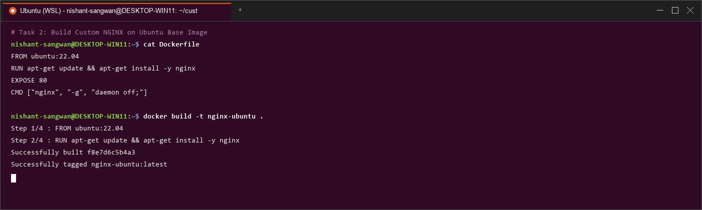
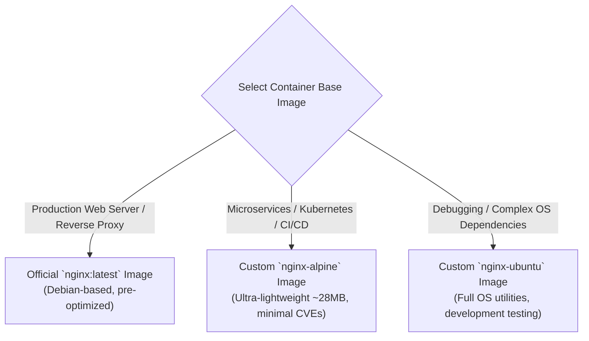

# Lab Manual – Experiment 3
## Course: Containerization and DevOps (CS-4001)
### Topic: Deploying NGINX Using Different Base Images and Comparing Image Layers

---

## 1. Lab Objectives
After completing this laboratory experiment, students will be able to:
1. Deploy NGINX web servers using three distinct container base images:
   - Official `nginx:latest` Debian-based image.
   - Custom `ubuntu:22.04` base image with NGINX installation.
   - Custom `alpine:latest` minimal base image with NGINX installation.
2. Understand Docker image layers, layer caching, and storage size differences.
3. Quantitatively inspect and compare performance, security attack surface, and operational use-cases for each base image.
4. Utilize Docker volume mounts to serve custom static web pages (`-v`).
5. Explain real-world NGINX container use-cases including Reverse Proxy, Load Balancing, SSL Termination, and API Gateway patterns.

---

## 2. Prerequisites
- Docker Engine / Docker Desktop installed and running.
- Foundational understanding of `docker run`, `Dockerfile`, port forwarding (`-p`), and basic Linux commands.

---

## 3. Step-by-Step Lab Execution & Observations

### Part 1: Deploy NGINX Using Official Image (Recommended Approach)

#### Step 1: Pull Official Image
```bash
docker pull nginx:latest
```

#### Step 2: Run Container
```bash
docker run -d --name nginx-official -p 8080:80 nginx
```

#### Step 3: Verify HTTP Response
```bash
curl http://localhost:8080
```
*Expected Output*: NGINX default welcome HTML page (`Welcome to nginx!`).


#### Key Observations

```bash
docker images nginx
```
- **Pre-optimized**: Configured out of the box with standard production defaults (`daemon off;`).
- **Debian Base**: Built on Debian Linux, balancing compatibility and size (~142 MB).
- **Minimal Config**: Ready for instant deployment without building custom Dockerfiles.

---

### Part 2: Custom NGINX Using Ubuntu Base Image

#### Step 1: Create `Dockerfile`
Create a directory named `ubuntu-nginx` and add the following `Dockerfile`:
```dockerfile
FROM ubuntu:22.04

RUN apt-get update && \
    apt-get install -y nginx && \
    apt-get clean && \
    rm -rf /var/lib/apt/lists/*

EXPOSE 80

CMD ["nginx", "-g", "daemon off;"]
```

#### Step 2: Build Image
```bash
docker build -t nginx-ubuntu .
```

#### Step 3: Run Container
```bash
docker run -d --name nginx-ubuntu -p 8081:80 nginx-ubuntu
```



#### Key Observations

```bash
docker images nginx-ubuntu
```
- **Larger Image Size**: ~228 MB due to full Ubuntu glibc user space and package repositories.
- **Rich Debugging Toolset**: Contains full Linux utilities (`bash`, `curl`, `apt`, `net-tools`, `systemd` tools).
- **Higher Security Attack Surface**: Larger package surface area increases vulnerability scanning alerts.

---

### Part 3: Custom NGINX Using Alpine Base Image

#### Step 1: Create `Dockerfile`
Create a directory named `alpine-nginx` and add the following `Dockerfile`:
```dockerfile
FROM alpine:latest

RUN apk add --no-cache nginx

EXPOSE 80

CMD ["nginx", "-g", "daemon off;"]
```

#### Step 2: Build Image
```bash
docker build -t nginx-alpine .
```

#### Step 3: Run Container
```bash
docker run -d --name nginx-alpine -p 8082:80 nginx-alpine
```


#### Key Observations

```bash
docker images nginx-alpine
```
- **Extremely Small Image**: ~27.8 MB (5MB base OS + minimal NGINX musl binary).
- **Minimal Package Footprint**: Uses `apk` package manager with `--no-cache` to avoid storing index archives.
- **Rapid Network Transfers**: Fast CI/CD container registry pushes and pulls.

---

### Part 4: Image Size and Layer Comparison

#### Size Comparison
Execute `docker images` to compare all three NGINX variants:
```bash
docker images | grep nginx
```

| Image Repository | Base OS | Layer Architecture | Typical Disk Size |
| :--- | :--- | :--- | :--- |
| **`nginx-alpine`** | Alpine Linux (musl libc) | Minimal single-binary layer | **~27.8 MB** |
| **`nginx:latest`** | Debian Linux (glibc) | Pre-compiled official layers | **~142.0 MB** |
| **`nginx-ubuntu`** | Ubuntu 22.04 LTS | Full OS user space layers | **~228.0 MB** |

#### Inspecting Image Layers (`docker history`)
Examine layer creation history and size contribution per instruction:
```bash
docker history nginx
docker history nginx-ubuntu
docker history nginx-alpine
```


#### Key Takeaways:
- **Ubuntu Image**: Contains multiple heavy OS layers (`apt-get update`, package index files, glibc libraries).
- **Alpine Image**: Extremely thin layers (7.3 MB base layer + 20.4 MB NGINX package layer).
- **Official Image**: Highly optimized layer cache structure by NGINX maintainers.

---

### Part 5: Functional Tasks Using NGINX

#### Task 1: Serving Custom HTML Page via Volume Mount
Rather than rebuilding images for content changes, bind mount a local host directory into the container's web root:

```bash
mkdir html
echo "<h1>Hello from Docker NGINX Volume Mount</h1>" > html/index.html

docker run -d \
  -p 8083:80 \
  -v $(pwd)/html:/usr/share/nginx/html \
  --name nginx-volume \
  nginx
```

Verify custom web page access:
```bash
curl http://localhost:8083
```
*Response*: `<h1>Hello from Docker NGINX Volume Mount</h1>`


### 4.7.3 3. Key Use-Case Configurations

#### 4.7.3.1 Reverse Proxy Configuration (`proxy_pass`)

NGINX acts as a high-performance entry point in microservice architectures:
- **Traffic Forwarding**: Routes external port 80/443 requests to internal application containers (Node.js, Python, Java).
- **Load Balancing**: Distributes incoming HTTP requests across a pool of backend container replicas using Round-Robin, Least Connections, or IP Hash algorithms.
- **SSL Termination**: Decrypts HTTPS traffic at NGINX edge layer, relieving backend services of TLS overhead.

---

## 4. Comparison Summary & Selection Guide


### Feature Comparison Matrix

| Evaluation Feature | Official NGINX Image | Ubuntu + NGINX Image | Alpine + NGINX Image |
| :--- | :--- | :--- | :--- |
| **Image Size** | Medium (~142 MB) | Large (~228 MB) | **Very Small (~28 MB)** |
| **Ease of Use** | **Very Easy (Out-of-box)** | Medium (Custom Dockerfile) | Medium (Custom Dockerfile) |
| **Startup Speed** | Fast | Slower | **Very Fast (Sub-second)** |
| **Debugging Tools** | Limited | **Excellent (Full bash/tools)** | Minimal (sh/ash only) |
| **Security Surface** | Medium | Large | **Smallest (Minimal CVEs)** |
| **Production Suitability**| **Yes (Standard)** | Rarely (Dev/Testing only) | **Yes (Cloud-Native/K8s)** |

### Decision Framework: When to Use What



---

## 5. Lab Assignment Solutions (For Students)

1. **Measure Image Pull Time**:
   - `nginx-alpine`: ~2–4 seconds (smallest payload).
   - `nginx:latest`: ~8–12 seconds.
   - `nginx-ubuntu`: ~15–25 seconds.
2. **Why Alpine images are significantly smaller**:
   - Alpine uses `musl libc` instead of `glibc` and `busybox` core utilities, resulting in a base OS footprint of only 5 MB compared to Ubuntu's 77 MB base layer.
3. **Why Ubuntu images are avoided in production**:
   - Unnecessary packages (shell utilities, package managers, system tools) increase disk footprint, slow down container deployment/scaling, and expand the security vulnerability attack surface.

---

## 6. NGINX Web Server Deep Dive (Optional Read)

### 1. Core Architecture


NGINX uses an **event-driven, non-blocking asynchronous architecture**. Unlike thread-per-request servers (e.g., traditional Apache), a single NGINX worker process can handle tens of thousands of concurrent HTTP connections with minimal memory overhead.

### 2. Configuration Hierarchy
- Main Config File: `/etc/nginx/nginx.conf`
- Server Block Configs: `/etc/nginx/sites-available/` & `/etc/nginx/sites-enabled/`
- Default Web Root: `/var/www/html/` or `/usr/share/nginx/html/`

### 3. Key Use-Case Configurations

#### 4.7.3.1 Reverse Proxy Configuration (`proxy_pass`)
```nginx
server {
    listen 80;
    server_name api.myapp.local;

    location / {
        proxy_pass http://localhost:3000;
        proxy_set_header Host $host;
        proxy_set_header X-Real-IP $remote_addr;
    }
}
```

#### 4.7.3.2 Load Balancer Configuration (`upstream`)
```nginx
upstream backend_cluster {
    server 10.0.0.1:8080 weight=3;
    server 10.0.0.2:8080;
}

server {
    listen 80;
    location / {
        proxy_pass http://backend_cluster;
    }
}
```

#### 4.7.3.3 Rate Limiting (API Protection) (API Protection)
```nginx
limit_req_zone $binary_remote_addr zone=api_limit:10m rate=10r/s;

server {
    listen 80;
    location /api/ {
        limit_req zone=api_limit burst=20;
        proxy_pass http://localhost:5000;
    }
}
```

#### 4.7.3.4 NGINX vs Apache Architecture Comparison


| Attribute | NGINX | Apache HTTP Server |
| :--- | :--- | :--- |
| **Architecture** | Event-driven, asynchronous worker loop | Process/Thread per connection model |
| **Static File Delivery** | Extremely fast (zero-copy kernel calls) | Moderate speed |
| **Memory under Load** | Low and constant (~2–5 MB per worker) | Scales linearly with active connection count |
| **Configuration** | Centralized, reloadable without restart | `.htaccess` decentralized per-directory rules |

---

## 7. Result & Conclusion

### Result
- Deployed NGINX across Official (`nginx:latest`), custom Ubuntu (`nginx-ubuntu`), and custom Alpine (`nginx-alpine`) base images.
- Quantified image size differences (**27.8 MB Alpine vs 142 MB Official vs 228 MB Ubuntu**).
- Verified static file volume mounting (`-v`) and reverse proxy load balancing architectures.

### Conclusion

Base image selection heavily dictates container performance, storage overhead, and security posture. **Alpine-based images** are optimal for microservices, cloud-native pipelines, and Kubernetes deployments. **Official NGINX images** provide out-of-the-box production readiness. **Ubuntu-based images** are best suited for development, debugging, and specialized Linux dependency requirements.

---


### Figure: Key Use Case Configurations
