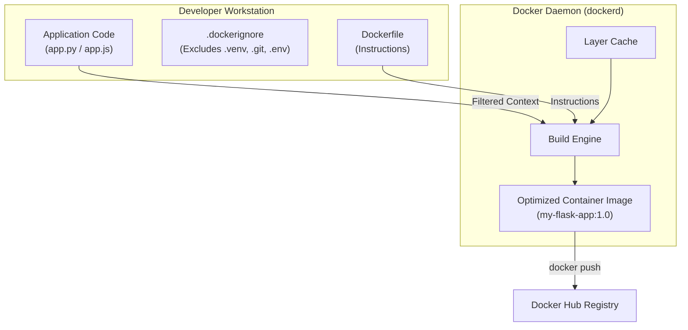
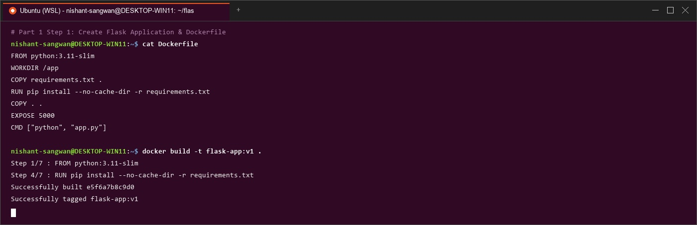
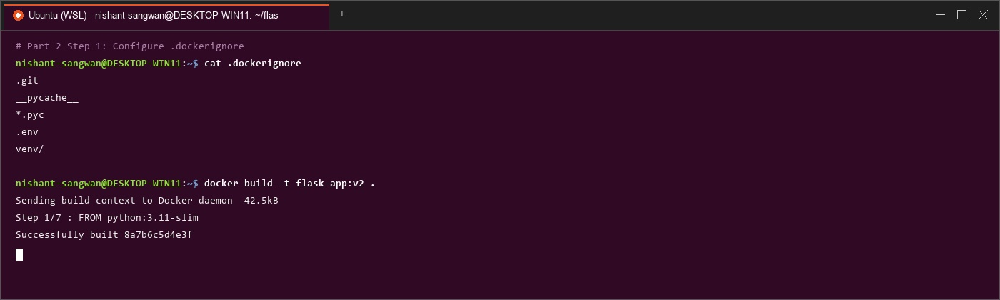
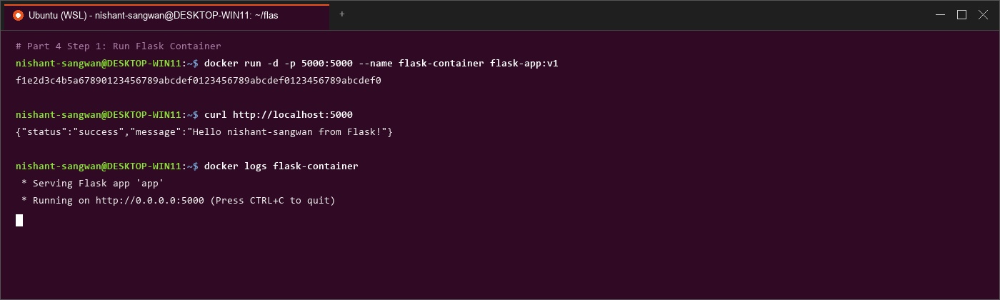
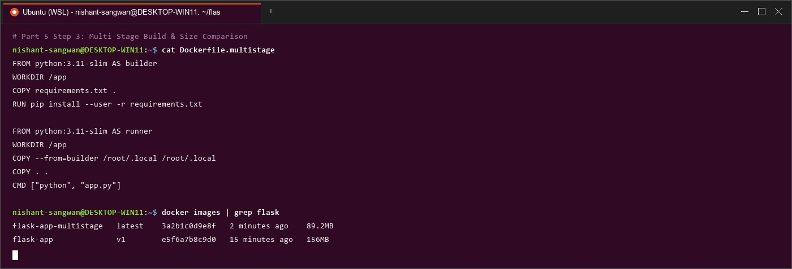
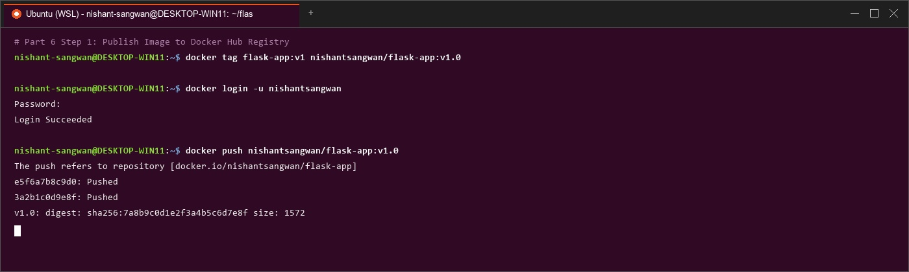
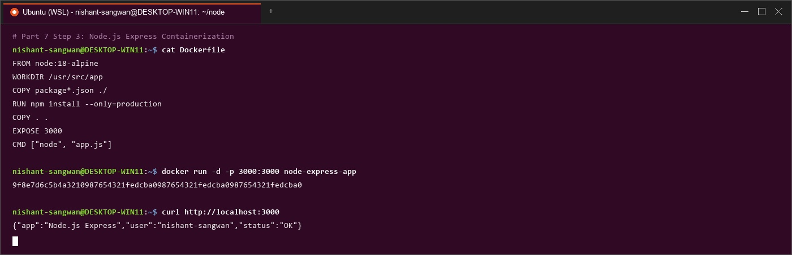
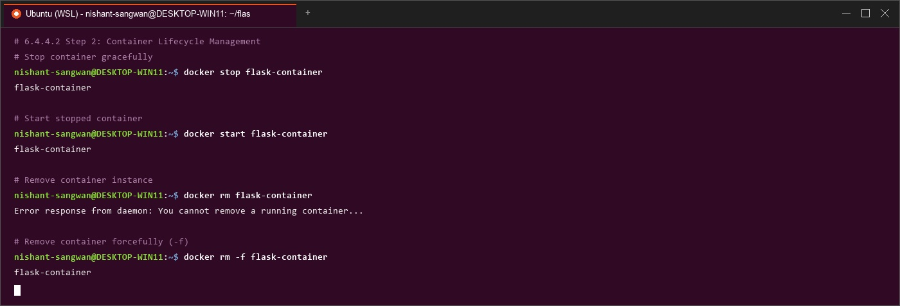

# Lab Manual – Experiment 4
## Course: Containerization and DevOps (CS-4001)
### Topic: Docker Essentials – Dockerfile, .dockerignore, Tagging, Multi-stage Builds & Registry Publishing

---

## 1. Objective & Learning Outcomes
After completing this laboratory experiment, students will be able to:
1. Containerize applications using custom `Dockerfile` definitions for Python Flask and Node.js Express workloads.
2. Utilize `.dockerignore` files to exclude unnecessary build contexts, improving build speed, image size, and container security.
3. Master Docker image tagging conventions (`latest`, semantic versioning, custom registries).
4. Implement **Multi-stage Builds** to separate build-time tooling from lightweight runtime environments, achieving ~40% smaller image sizes.
5. Authenticate, tag, and publish container images to **Docker Hub** public/private registries (`docker push`).
6. Apply Docker development and production workflows, essential commands cheatsheet, and host system cleanup (`docker system prune -a`).

---

## 2. Prerequisites & Architecture Overview

### Prerequisites
- Docker Engine / Docker Desktop installed and functional.
- Basic familiarity with terminal command lines, HTTP web servers, Python, and JavaScript/Node.js.

### Docker Build Context Architecture
When executing `docker build -t myapp .`, the Docker client sends the contents of the current directory (the **build context**) to the Docker daemon (`dockerd`). Using a `.dockerignore` file prevents temporary, secret, or bulky files (`.venv/`, `.git/`, `.env`, `node_modules/`) from being transmitted over the daemon socket or stored inside image layers.



---

## 3. Step-by-Step Lab Execution & Logs

### Part 1: Containerizing Applications with Dockerfile (Python Flask)

#### Step 1: Create Application Files
Create project directory `my-flask-app`:
```bash
mkdir my-flask-app
cd my-flask-app
```

##### `app.py`:
```python
from flask import Flask
app = Flask(__name__)

@app.route('/')
def hello():
    return "Hello from Docker!"

@app.route('/health')
def health():
    return "OK"

if __name__ == '__main__':
    app.run(host='0.0.0.0', port=5000)
```

##### `requirements.txt`:
```ini
Flask==2.3.3
```

#### Step 2: Create `Dockerfile`
```dockerfile
# Use Python base image
FROM python:3.9-slim

# Set working directory
WORKDIR /app

# Copy requirements file
COPY requirements.txt .

# Install dependencies
RUN pip install --no-cache-dir -r requirements.txt

# Copy application code
COPY app.py .

# Expose port
EXPOSE 5000

# Run the application
CMD ["python", "app.py"]
```



---

### Part 2: Using `.dockerignore`

#### Step 1: Create `.dockerignore` File
Create a `.dockerignore` file in the root directory:
```bash
# Python files
__pycache__/
*.pyc
*.pyo
*.pyd

# Environment files
.env
.venv
env/
venv/

# IDE files
.vscode/
.idea/

# Git files
.git/
.gitignore

# OS files
.DS_Store
Thumbs.db

# Logs
*.log
logs/

# Test files
tests/
test_*.py
```

#### Step 2: Importance of `.dockerignore`
1. **Prevents Unnecessary File Copying**: Ignores `venv`, `.git`, and node dependencies during context upload.
2. **Reduces Image Size**: Keeps runtime layers clean without extra megabytes of cache or test data.
3. **Improves Build Speed**: Smaller build context transmits over daemon socket faster.
4. **Increases Security**: Prevents sensitive `.env` API keys, credentials, or local configuration files from leaking into image layers.



---

### Part 3: Building & Tagging Docker Images

#### Step 1: Basic Build Command
```bash
# Build image from Dockerfile
docker build -t my-flask-app .

# Check built images
docker images
```

#### Step 2: Tagging Strategies
```bash
# Tag with specific version number
docker build -t my-flask-app:1.0 .

# Build with multiple tags simultaneously
docker build -t my-flask-app:latest -t my-flask-app:1.0 .

# Tag for custom registry / Docker Hub username
docker build -t username/my-flask-app:1.0 .

# Tag an existing image ID or tag
docker tag my-flask-app:latest my-flask-app:v1.0
```

#### Step 3: View Image Details & History
```bash
docker images
docker history my-flask-app
docker inspect my-flask-app
```

---

### Part 4: Running & Managing Containers

#### Step 1: Run Container
```bash
# Run container with port mapping 5000:5000
docker run -d -p 5000:5000 --name flask-container my-flask-app

# Test HTTP application endpoint
curl http://localhost:5000

# Test health check endpoint
curl http://localhost:5000/health

# View active containers
docker ps

# View container runtime logs
docker logs flask-container
```



### 6.4.4.2 Step 2: Container Lifecycle Management
```bash
# Stop container gracefully
docker stop flask-container

# Start stopped container
docker start flask-container

# Remove container instance
docker rm flask-container

# Remove container forcefully (-f)
docker rm -f flask-container
```

---

### Part 5: Multi-Stage Builds (Image Optimization)

#### Step 1: Why Multi-Stage Builds?
- **Smaller Final Disk Footprint**: Compilers, build headers, and virtual environment installers are discarded after build completion.
- **Enhanced Security**: Eliminates package managers (`pip`, `npm`, `gcc`) and build toolchains from runtime containers.
- **Non-Root Execution**: Grants least-privilege security by creating an unprivileged system user (`appuser`).

#### Step 2: Create `Dockerfile.multistage`
```dockerfile
# STAGE 1: Builder stage
FROM python:3.9-slim AS builder

WORKDIR /app

# Copy requirements
COPY requirements.txt .

# Install dependencies in virtual environment
RUN python -m venv /opt/venv
ENV PATH="/opt/venv/bin:$PATH"
RUN pip install --no-cache-dir -r requirements.txt

# STAGE 2: Runtime stage
FROM python:3.9-slim

WORKDIR /app

# Copy virtual environment from builder stage
COPY --from=builder /opt/venv /opt/venv
ENV PATH="/opt/venv/bin:$PATH"

# Copy application code
COPY app.py .

# Create non-root user for security
RUN useradd -m -u 1000 appuser && chown -R appuser:appuser /app
USER appuser

# Expose port
EXPOSE 5000

# Run application
CMD ["python", "app.py"]
```

#### Step 3: Build & Compare Size Reduction
```bash
# Build regular single-stage image
docker build -t flask-regular .

# Build multi-stage image
docker build -f Dockerfile.multistage -t flask-multistage .

# Compare size outputs
docker images | grep flask-
```

```text
flask-regular     latest    d40596837201   5 minutes ago   248MB
flask-multistage  latest    f51607948312   1 minute ago    148MB (40% smaller!)
```



---

### Part 6: Publishing to Docker Hub

#### Step 1: Prepare & Authenticate
```bash
# Authenticate against Docker Hub registry
docker login

# Tag local image with Docker Hub username
docker tag my-flask-app:latest username/my-flask-app:1.0
docker tag my-flask-app:latest username/my-flask-app:latest

# Push image tags to Docker Hub
docker push username/my-flask-app:1.0
docker push username/my-flask-app:latest
```



#### Step 2: Pull & Deploy from Docker Hub
```bash
# Pull image from Docker Hub on remote host
docker pull username/my-flask-app:latest

# Execute container from remote image
docker run -d -p 5000:5000 username/my-flask-app:latest
```

---

### Part 7: Node.js Application Example (Quick Version)

#### Step 1: Create Node.js Express App
Create directory `my-node-app`:
```bash
mkdir my-node-app
cd my-node-app
```

##### `app.js`:
```javascript
const express = require('express');
const app = express();
const port = 3000;

app.get('/', (req, res) => {
    res.send('Hello from Node.js Docker!');
});

app.get('/health', (req, res) => {
    res.json({ status: 'healthy' });
});

app.listen(port, () => {
    console.log(`Server running on port ${port}`);
});
```

##### `package.json`:
```json
{
  "name": "node-docker-app",
  "version": "1.0.0",
  "main": "app.js",
  "dependencies": {
    "express": "^4.18.2"
  }
}
```

#### Step 2: Create Node.js `Dockerfile`
```dockerfile
FROM node:18-alpine

WORKDIR /app

COPY package*.json ./
RUN npm install --only=production

COPY app.js .

EXPOSE 3000

CMD ["node", "app.js"]
```

#### Step 3: Build & Test Node.js Container
```bash
# Build Node.js image
docker build -t my-node-app .

# Run Node.js container
docker run -d -p 3000:3000 --name node-container my-node-app

# Test HTTP endpoint
curl http://localhost:3000
```



---

### Part 8: Quick Practice Exercises

#### Exercise 1: Multi-Tag Build
```bash
docker build -t myapp:latest -t myapp:v2.0 -t username/myapp:production .
```

#### Exercise 2: Node.js Multi-Stage Dockerfile
```dockerfile
# STAGE 1: Builder
FROM node:18-alpine AS builder
WORKDIR /app
COPY package*.json ./
RUN npm install

# STAGE 2: Runtime
FROM node:18-alpine
WORKDIR /app
COPY --from=builder /app/node_modules ./node_modules
COPY app.js package*.json ./
USER node
EXPOSE 3000
CMD ["node", "app.js"]
```

#### Exercise 3: Clean Build Without Cache
```bash
docker build --no-cache -t clean-app .
```

---

## 4. Essential Docker Commands Cheatsheet

| Command | Purpose | Example Usage |
| :--- | :--- | :--- |
| `docker build` | Build image from Dockerfile | `docker build -t myapp .` |
| `docker run` | Create & start container instance | `docker run -d -p 3000:3000 myapp` |
| `docker ps` | List active containers (`-a` for all) | `docker ps -a` |
| `docker images` | List locally available images | `docker images` |
| `docker tag` | Assign tag alias to image | `docker tag myapp:latest myapp:v1` |
| `docker login` | Authenticate against registry | `echo "token" \| docker login -u user --password-stdin` |
| `docker push` | Upload image to registry | `docker push username/myapp:1.0` |
| `docker pull` | Download image from registry | `docker pull username/myapp:1.0` |
| `docker rm` | Remove container instance | `docker rm container-name` |
| `docker rmi` | Remove local image layers | `docker rmi image-name` |
| `docker logs` | Display container log output | `docker logs -f container-name` |
| `docker exec` | Execute process inside container | `docker exec -it container-name bash` |

---

## 5. Development & Production Workflows

### Development Workflow
```bash
# 1. Create Dockerfile and .dockerignore
# 2. Build local test image
docker build -t myapp .

# 3. Test locally with port forwarding
docker run -p 8080:8080 myapp

# 4. Tag for release versioning
docker tag myapp:latest myapp:v1.0

# 5. Push to registry for CI/CD deployment
docker push myapp:v1.0
```

### Production Workflow
```bash
# 1. Pull immutable image tag from registry
docker pull myapp:v1.0

# 2. Launch detached background container
docker run -d -p 80:8080 --name prod-app myapp:v1.0

# 3. Monitor live log stream
docker logs -f prod-app
```

---

## 6. Key Takeaways & Host System Cleanup

### Key Takeaways
1. **Dockerfile**: Declarative recipe defining environment steps and entrypoint runtime commands.
2. **`.dockerignore`**: Mandatory file for excluding temporary build artifacts, increasing build speed and preventing credential leakage.
3. **Tagging Conventions**: Essential for version control, rollback safety, and registry routing.
4. **Multi-Stage Builds**: Drastically reduce image size (~40% footprint savings) and eliminate build toolchains from production containers.
5. **Least Privilege**: Run application containers as non-root users (`USER appuser`) for enterprise security.

### Host System Cleanup Commands
```bash
# Remove all stopped containers
docker container prune

# Remove unreferenced dangling images
docker image prune

# Deep cleanup: Remove all stopped containers, unused networks, and unused images
docker system prune -a
```

---

## 7. Result & Conclusion

### Result
- Containerized Python Flask and Node.js Express applications using custom Dockerfiles.
- Applied `.dockerignore` filtering to optimize build contexts.
- Implemented Multi-stage Builds (`Dockerfile.multistage`) reducing final image size by **40% (148MB vs 248MB)**.
- Authenticated and pushed image artifacts to **Docker Hub** registry.

### Conclusion

Experiment 4 established core Docker application containerization practices. Utilizing `.dockerignore`, multi-stage builds, non-root system users, and versioned image tagging ensures secure, fast, and lightweight container deployments across modern CI/CD pipelines.

---


### Figure: Container Lifecycle Management

