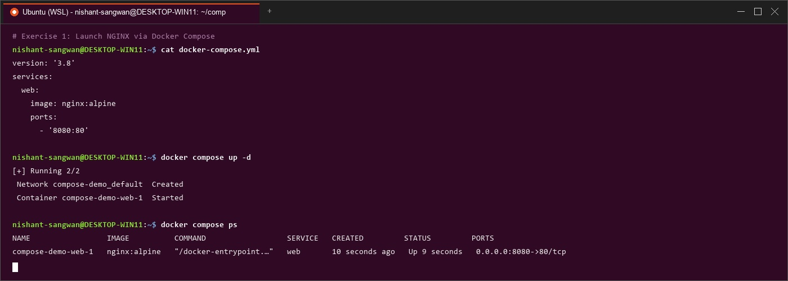

# Lab Manual – Experiment 6
## Course: Containerization and DevOps (CS-4001)
### Topic: Comparison of Docker Run and Docker Compose & Multi-Container WordPress + MySQL Application


---

## PART A – THEORY

### 1. Objective
To understand the relationship between `docker run` and **Docker Compose**, compare their configuration syntax, analyze imperative vs. declarative container management approaches, and deploy production-ready multi-container applications (WordPress + MySQL) with volume persistence, custom builds, resource limits, and Docker Swarm orchestration.

---

### 2. Background Theory

#### 2.1 Docker Run (Imperative Approach)


The `docker run` command is used to create and start a container from an image. It requires explicit flags for:
- Port mapping (`-p`)
- Volume mounting (`-v`)
- Environment variables (`-e`)
- Network configuration (`--network`)
- Restart policies (`--restart`)
- Resource limits (`--memory`, `--cpus`)
- Container name (`--name`)

This approach is **imperative**, meaning you specify step-by-step instructions in the terminal.

```bash
docker run -d \
  --name my-nginx \
  -p 8080:80 \
  -v ./html:/usr/share/nginx/html \
  -e NGINX_HOST=localhost \
  --restart unless-stopped \
  nginx:alpine
```

#### 2.2 Docker Compose (Declarative Approach)


Docker Compose uses a YAML file (`docker-compose.yml`) to define services, networks, and volumes in a structured, version-controlled format.

Instead of multiple `docker run` commands, a single command is used:
```bash
docker compose up -d
```

Compose is **declarative**, meaning you define the desired state of the entire multi-container application.

##### Equivalent `docker-compose.yml`:
```yaml
version: '3.8'

services:
  nginx:
    image: nginx:alpine
    container_name: my-nginx
    ports:
      - "8080:80"
    volumes:
      - ./html:/usr/share/nginx/html
    environment:
      NGINX_HOST: localhost
    restart: unless-stopped
```

---

### 3. Mapping: Docker Run vs Docker Compose


| Docker Run Flag | Docker Compose Equivalent | Description |
| :--- | :--- | :--- |
| `-p 8080:80` | `ports:` | Binds host port to container port |
| `-v host:container` | `volumes:` | Mounts host path or named volume |
| `-e KEY=value` | `environment:` | Passes environment configuration |
| `--name` | `container_name:` | Assigns custom container instance name |
| `--network` | `networks:` | Connects container to defined network |
| `--restart` | `restart:` | Defines crash/reboot restart policy |
| `--memory` | `deploy.resources.limits.memory` | Constrains maximum RAM allocation |
| `--cpus` | `deploy.resources.limits.cpus` | Limits CPU core consumption |
| `-d` | `docker compose up -d` | Executes service in background mode |

---

### 4. Advantages of Docker Compose


1. **Simplifies Multi-Container Applications**: Orchestrates complex architectures in a single file.
2. **Provides Reproducibility**: Enables identical development, testing, and staging environments across team members.
3. **Version Controllable**: `docker-compose.yml` can be checked into Git alongside source code.
4. **Unified Lifecycle Management**: Single-command startup (`up`), shutdown (`down`), and log monitoring (`logs`).
5. **Supports Service Scaling**: Easily scale web workers using `docker compose up --scale web=3`.

---

## PART B – PRACTICAL TASKS

### Task 1: Single Container Comparison

#### Step 1: Run Nginx Using `docker run`


```bash
# Execute imperative command
docker run -d \
  --name lab-nginx \
  -p 8081:80 \
  -v $(pwd)/html:/usr/share/nginx/html \
  nginx:alpine

# Verify container
docker ps

# Test HTTP endpoint
curl http://localhost:8081

# Stop and remove container
docker stop lab-nginx
docker rm lab-nginx
```

#### Step 2: Run Same Setup Using Docker Compose


Create `docker-compose.yml`:
```yaml
version: '3.8'

services:
  nginx:
    image: nginx:alpine
    container_name: lab-nginx
    ports:
      - "8081:80"
    volumes:
      - ./html:/usr/share/nginx/html
```

```bash
# Launch service in detached mode
docker compose up -d

# Verify service state
docker compose ps

# Teardown stack
docker compose down
```



---

### Task 2: Multi-Container Application (WordPress + MySQL)

#### Objective
Deploy WordPress with MySQL using:
1. Docker Run (manual imperative way)
2. Docker Compose (structured declarative way)

#### A. Using Docker Run (Imperative Way)


```bash
# 1. Create custom network
docker network create wp-net

# 2. Run MySQL database container
docker run -d \
  --name mysql \
  --network wp-net \
  -e MYSQL_ROOT_PASSWORD=secret \
  -e MYSQL_DATABASE=wordpress \
  mysql:5.7

# 3. Run WordPress application container
docker run -d \
  --name wordpress \
  --network wp-net \
  -p 8082:80 \
  -e WORDPRESS_DB_HOST=mysql \
  -e WORDPRESS_DB_PASSWORD=secret \
  wordpress:latest

# Test connection in browser: http://localhost:8082
```

#### B. Using Docker Compose (Declarative Way)


Create `docker-compose.yml`:
```yaml
version: '3.8'

services:
  mysql:
    image: mysql:5.7
    environment:
      MYSQL_ROOT_PASSWORD: secret
      MYSQL_DATABASE: wordpress
    volumes:
      - mysql_data:/var/lib/mysql

  wordpress:
    image: wordpress:latest
    ports:
      - "8082:80"
    environment:
      WORDPRESS_DB_HOST: mysql
      WORDPRESS_DB_PASSWORD: secret
    depends_on:
      - mysql

volumes:
  mysql_data:
```

```bash
# Bring up multi-container stack
docker compose up -d

# Stop stack and remove volumes
docker compose down -v
```


---

## PART C – CONVERSION & BUILD-BASED TASKS

### Task 3: Convert Docker Run to Docker Compose


#### Problem 1: Basic Web Application Conversion
##### Given `docker run` command:


```bash
docker run -d \
  --name webapp \
  -p 5000:5000 \
  -e APP_ENV=production \
  -e DEBUG=false \
  --restart unless-stopped \
  node:18-alpine
```

##### Equivalent `docker-compose.yml`:
```yaml
version: '3.8'

services:
  webapp:
    image: node:18-alpine
    container_name: webapp
    ports:
      - "5000:5000"
    environment:
      - APP_ENV=production
      - DEBUG=false
    restart: unless-stopped
```

#### Problem 2: Volume + Network Configuration Conversion
##### Given `docker run` commands:


```bash
docker network create app-net

docker run -d \
  --name postgres-db \
  --network app-net \
  -e POSTGRES_USER=admin \
  -e POSTGRES_PASSWORD=secret \
  -v pgdata:/var/lib/postgresql/data \
  postgres:15

docker run -d \
  --name backend \
  --network app-net \
  -p 8000:8000 \
  -e DB_HOST=postgres-db \
  -e DB_USER=admin \
  -e DB_PASS=secret \
  python:3.11-slim
```

##### Equivalent `docker-compose.yml`:
```yaml
version: '3.8'

services:
  postgres-db:
    image: postgres:15
    container_name: postgres-db
    environment:
      POSTGRES_USER: admin
      POSTGRES_PASSWORD: secret
    volumes:
      - pgdata:/var/lib/postgresql/data
    networks:
      - app-net

  backend:
    image: python:3.11-slim
    container_name: backend
    ports:
      - "8000:8000"
    environment:
      DB_HOST: postgres-db
      DB_USER: admin
      DB_PASS: secret
    depends_on:
      - postgres-db
    networks:
      - app-net

volumes:
  pgdata:

networks:
  app-net:
```


---

### Task 4: Resource Limits Conversion

##### Given `docker run` command:


```bash
docker run -d \
  --name limited-app \
  -p 9000:9000 \
  --memory="256m" \
  --cpus="0.5" \
  --restart always \
  nginx:alpine
```

##### Equivalent `docker-compose.yml`:
```yaml
version: '3.8'

services:
  limited-app:
    image: nginx:alpine
    container_name: limited-app
    ports:
      - "9000:9000"
    restart: always
    deploy:
      resources:
        limits:
          cpus: '0.50'
          memory: 256M
```

#### Explanation:
1. **When `deploy` works**: In Docker Compose v3+, `deploy.resources.limits` is respected by `docker compose` (with Compose V2 engine) as well as Docker Swarm.
2. **Normal Compose Mode vs Swarm Mode**: In normal Compose mode, container resource limits are set on the single local daemon via `cgroups`. In Swarm mode, resource limits govern multi-node placement and container scheduling.


---

## PART D – USING DOCKERFILE INSTEAD OF STANDARD IMAGE

### Task 5: Replace Standard Image with Dockerfile (Node App)

#### Step 1: Create `app.js`
```javascript
const http = require('http');

http.createServer((req, res) => {
  res.end("Docker Compose Build Lab - Custom Node App");
}).listen(3000);
```

#### Step 2: Create `Dockerfile`
```dockerfile
FROM node:18-alpine

WORKDIR /app

COPY app.js .

EXPOSE 3000

CMD ["node", "app.js"]
```

#### Step 3: Create `docker-compose.yml`
```yaml
version: '3.8'

services:
  nodeapp:
    build:
      context: .
      dockerfile: Dockerfile
    container_name: custom-node-app
    ports:
      - "3000:3000"
```

```bash
# Build and run container
docker compose up --build -d

# Verify endpoint
curl http://localhost:3000
```

##### `image:` vs `build:` Difference:
- `image:` pulls a pre-compiled image directly from a container registry (e.g. Docker Hub).
- `build:` instructs Compose to build a fresh container image locally from a `Dockerfile` before launching the service.


---

### Task 6: Advanced Build Challenge (Multi-Stage Dockerfile with Compose)

#### Requirements
Create a production-ready application using a multi-stage Dockerfile, custom build in Compose, environment variables, and volume mount for hot reloading.

##### `Dockerfile.multistage`:
```dockerfile
# STAGE 1: Builder stage
FROM node:18-alpine AS builder
WORKDIR /app
COPY package*.json ./
RUN npm install

# STAGE 2: Production runtime stage
FROM node:18-alpine
WORKDIR /app
COPY --from=builder /app/node_modules ./node_modules
COPY app.js .
USER node
EXPOSE 3000
CMD ["node", "app.js"]
```

##### `docker-compose.yml`:
```yaml
version: '3.8'

services:
  app:
    build:
      context: .
      dockerfile: Dockerfile.multistage
    environment:
      - NODE_ENV=production
    volumes:
      - ./app.js:/app/app.js
    ports:
      - "3000:3000"
```

```bash
# Compare image footprint
docker images | grep task6
```


---

## EXPERIMENT 6 B: Multi-Container Application using Docker Compose (WordPress + MySQL)


### 1. Objective
To deploy a production-like multi-container application using **Docker Compose**, consisting of:
- **WordPress** (frontend web application + PHP engine)
- **MySQL** (backend database)

Also:
- Master container networking and volume persistence.
- Evaluate service scaling mechanics and reverse proxy load balancing.
- Compare Docker Compose with **Docker Swarm** for production multi-node cluster deployment.

---

### 2. Architecture Overview

```text
User (Browser)
      |
   WordPress Container (Port 8080:80)
      | (Internal Bridge Network: wp-compose-lab_default)
   MySQL Container (Port 3306)
      |
   Persistent Volumes (db_data & wp_data)
```

- WordPress communicates with MySQL using service name (`db`) via Docker internal DNS.
- Database state and WordPress web files persist independently using named volumes.

---

### 3. Step-by-Step Implementation

#### Step 1: Create Project Directory
```bash
mkdir wp-compose-lab
cd wp-compose-lab
```

#### Step 2: Create `docker-compose.yml`
```yaml
version: '3.9'

services:
  db:
    image: mysql:5.7
    container_name: wordpress_db
    restart: always
    environment:
      MYSQL_ROOT_PASSWORD: rootpass
      MYSQL_DATABASE: wordpress
      MYSQL_USER: wpuser
      MYSQL_PASSWORD: wppass
    volumes:
      - db_data:/var/lib/mysql

  wordpress:
    image: wordpress:latest
    container_name: wordpress_app
    depends_on:
      - db
    ports:
      - "8080:80"
    restart: always
    environment:
      WORDPRESS_DB_HOST: db:3306
      WORDPRESS_DB_USER: wpuser
      WORDPRESS_DB_PASSWORD: wppass
      WORDPRESS_DB_NAME: wordpress
    volumes:
      - wp_data:/var/www/html

volumes:
  db_data:
  wp_data:
```

#### Step 3: Explanation of Key Sections
- `services`: Defines container workloads (`db` and `wordpress`).
- `depends_on`: Guarantees `db` initializes prior to `wordpress`.
- `environment`: Passes credentials and DB endpoint configuration dynamically.
- `volumes`: Preserves database records (`db_data`) and uploaded media (`wp_data`).
- `ports`: Maps host port `8080` to container port `80`.

#### Step 4: Launch & Verify Application
```bash
# Start services in background
docker-compose up -d

# Verify active containers
docker ps

# List volumes created
docker volume ls
```


---

### 4. Scaling in Docker Compose


#### Scaling WordPress Containers
```bash
docker-compose up --scale wordpress=3 -d
```

#### Scaling Limitation & Reverse Proxy Solution
- **Problem**: Scaling multiple instances of `wordpress` causes port conflict if host port `8080:80` is statically bound to the container.
- **Solution**: Remove static host port mapping from application workers and route traffic through an **Nginx Reverse Proxy** or Load Balancer container listening on port `8080`.

---

### 5. Running Same Setup with Docker Swarm

#### Step 1: Initialize Swarm Cluster
```bash
docker swarm init
```

#### Step 2: Deploy Stack to Swarm
```bash
docker stack deploy -c docker-compose.yml wpstack
```

#### Step 3: Scale Service in Swarm
```bash
docker service scale wpstack_wordpress=3
```


---

### 6. Comparison: Docker Compose vs Docker Swarm


| Feature | Docker Compose | Docker Swarm |
| :--- | :--- | :--- |
| **Target Scope** | Single Host Development / Testing | Multi-Node Production Cluster |
| **Scaling** | Manual (`--scale`), port conflicts | Built-in native service scaling |
| **Load Balancing** | None (requires external proxy) | Built-in Routing Mesh & Load Balancer |
| **Self-Healing** | Container restart policies only | Automatic task rescheduling on node failure |
| **Rolling Updates** | Requires manual restart | Zero-downtime rolling updates (`--update-delay`) |
| **Networking** | Local Bridge Network | Encrypted Multi-Host Overlay Network |

---

### 7. Key Learning Outcomes & Conclusion

1. **Imperative vs. Declarative**: `docker run` is imperative and error-prone for complex setups; Docker Compose provides declarative, version-controlled architecture definitions.
2. **Multi-Container Synergy**: Compose handles automatic network creation, DNS resolution between services (`db`), volume management (`db_data`), and startup ordering (`depends_on`).
3. **Custom Build Integration**: Compose seamlessly integrates custom `Dockerfile` builds using `build: .`.
4. **Orchestration Evolution**: While Compose is ideal for local development, production multi-node environments benefit from Docker Swarm or Kubernetes for self-healing, rolling updates, and ingress load balancing.